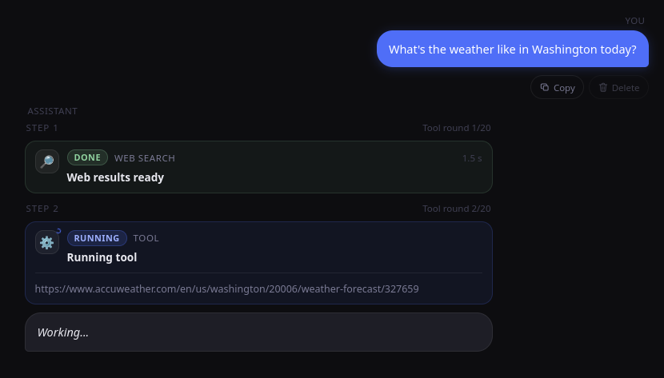
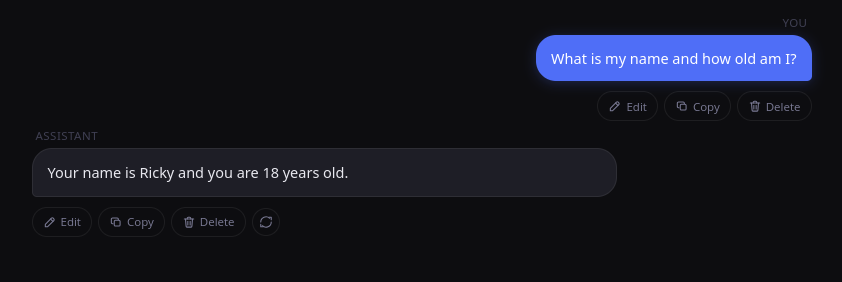
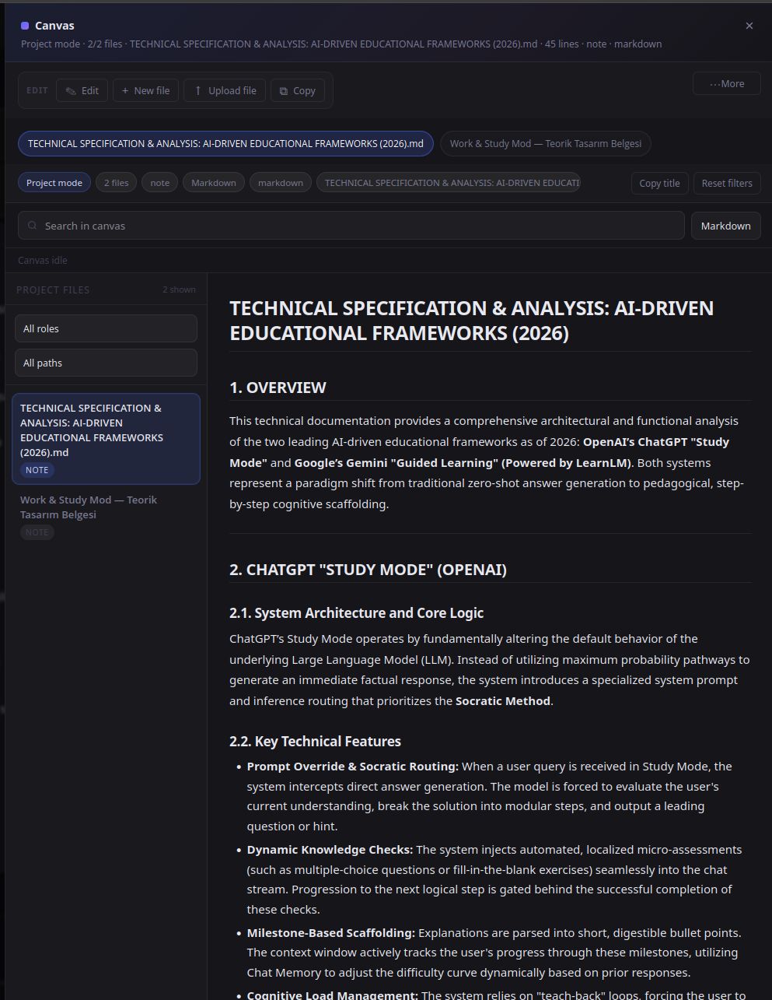
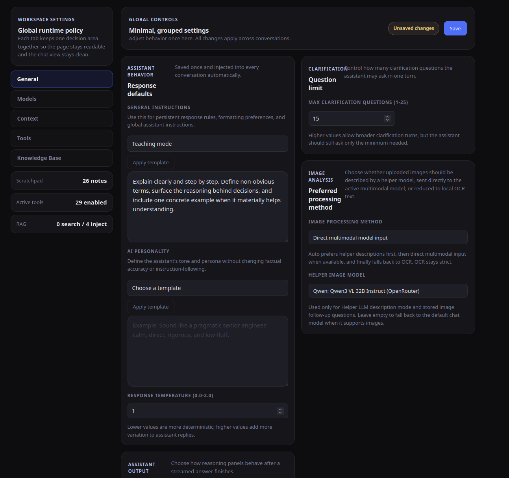

# Flask ChatBot: Multi-Provider + Tools + RAG + OCR + Multimodal + Canvas + Memory + Workspace

This is a single-page Flask chat application built around DeepSeek plus optional OpenRouter models, multi-step tool use, registry-driven composer slash commands, local RAG, dedicated local OCR, configurable helper/direct image analysis, conversation summarization, pruning, user-configurable entropy-aware context selection, persistent conversation memory, persona-scoped memory, editable canvas documents, page-aware canvas navigation, per-conversation parameter overrides, activity/audit logging, and a per-conversation workspace sandbox.

It is not a minimal prompt/response demo. The app keeps conversation history in SQLite, restores assistant metadata when a conversation is reopened, supports editing earlier user messages, streams tool progress and reasoning, can enrich a user turn with local OCR or extracted document text before the model sees it, exposes persona and conversation memory APIs, logs outbound model activity for auditing, and can compact older content with summaries and pruning.

## Screenshots

### Tool execution



### Long-term memory (RAG)



### Canvas view



### Settings page



## Contents

- [What the app does](#what-the-app-does)
- [Screenshots](#screenshots)
- [Architecture overview](#architecture-overview)
- [Project structure](#project-structure)
- [Installation](#installation)
- [Configuration](#configuration)
- [Using the app](#using-the-app)
- [Available tools](#available-tools)
- [HTTP endpoints](#http-endpoints)
- [Data storage](#data-storage)
- [Development](#development)
- [Security and operational notes](#security-and-operational-notes)
- [Troubleshooting](#troubleshooting)
- [FAQ](#faq)
- [License](#license)

## What the app does

### Chat and conversation workflow

- Create, open, rename, and delete conversations
- Stream assistant output to the browser as NDJSON events
- Persist messages, usage metadata, tool traces, reasoning content, and canvas state in SQLite
- Cancel an active response mid-stream
- Persist partial assistant output during graceful cancellation through the chat-run cancel API
- Clear the current chat view without deleting stored conversations
- Automatically set a concise title on the first turn through an internal tool call (`set_conversation_title`) and support manual title refresh on demand
- Edit a previous user message, delete later turns, and regenerate from that branch
- Restore assistant metadata, reasoning, tool results, and canvas state when reopening a conversation
- Show a slash-command picker in the composer when the user types `/`, with registry-backed command insertion and keyboard navigation
- Show a separate Fix action that rewrites the current draft before sending
- Set per-conversation generation overrides (`temperature`, `top_p`, `max_tokens`) from the in-chat **Set Parameters** panel
- Manually summarize a conversation, undo an inserted summary, and prune older visible messages
- Preview a summary before applying it, inspect prune scores, and prune selected messages explicitly
- Switch the context-selection strategy between classic history, entropy-only, and entropy + RAG hybrid modes from Settings

### Model and agent behavior

- Ships with built-in DeepSeek chat and reasoner models
- Supports user-defined OpenRouter models from Settings, including tool-capable, vision-capable, provider-scoped, and reasoning-configured models
- Uses OpenAI-compatible clients for both DeepSeek and OpenRouter providers
- Routes OpenRouter requests through configured proxy candidates before falling back to a direct connection
- Validates tool names and tool argument schemas before execution
- Supports native function calls from the model
- Supports model-emitted tool JSON fallback handling
- Uses centralized tool-runtime metadata (`tool_registry.py`) to keep prompt guidance and runtime scheduling aligned for read-only parallel-safe tools, cacheable tools, canvas read barriers, and UI-hidden internal tools
- Limits tool rounds with configurable `max_steps` from 1 to 50
- Encourages the model to batch independent read-only tool calls in one turn (instead of serial one-by-one fan-out), then reason across the combined results
- Keeps canvas mutation+read safety barriers in place so same-turn canvas reads do not observe stale pre-mutation state
- Forces a final-answer phase when the tool budget is exhausted
- Tracks estimated prompt composition locally across the stable runtime/system prefix, tool specs, canvas context, conversation memory, scratchpad, tool trace, tool memory, RAG context, message history, tool calls, tool results, and provider overhead
- Estimates per-turn and session cost when pricing is known for the selected provider; unsupported providers fall back to unknown-cost reporting
- Writes rotating agent trace logs to `logs/agent-trace.log` by default

### Attachments

- Image uploads can use a helper vision-capable LLM selected separately in Settings, go directly to the active multimodal chat model, or use the configured local OCR depending on the selected image-processing method
- Document uploads are extracted locally and injected into the conversation context
- Supported image formats:
  - PNG
  - JPEG
  - WEBP
- Supported document formats:
  - DOCX
  - PDF
  - TXT
  - CSV
  - Markdown
  - Common code and config files such as Python, JavaScript, TypeScript, JSON, HTML, CSS, YAML, SQL, and shell scripts

### Memory and retrieval

- Conversation-scoped memory for important user details, decisions, task context, and critical tool outcomes from the current chat
- Persona-scoped memory shared across conversations that use the same persona
- Persistent scratchpad for durable user-specific facts and preferences
- Persistent user profile memory extracted from structured conversation summaries
- Tool memory for successful web/news/URL results from earlier sessions
- RAG knowledge base built from stored conversations, successful text-like tool results, remembered web results, and uploaded documents
- Optional auto-injection of retrieved RAG context into each turn
- Optional auto-injection of conversation memory into each turn
- Optional auto-injection of remembered tool results into each turn
- Entropy-aware history selection can keep dense or later-referenced blocks while dropping low-value filler before retrieval runs
- RAG source pools can be scoped in Settings to conversations, tool results, tool memory, and uploaded documents
- Structured clarification tool for cases where the request is underspecified

### Canvas documents

- The model can create and edit canvas documents (Markdown or code) attached to the current conversation
- The model can also create code-format canvas documents with language metadata, path/role metadata, and project summaries when working in project mode
- The UI can display multiple canvas documents, search within them, filter them, and export them
- Canvas documents support line-level edits, batch edits, bulk find-replace transforms, batch reads, validation checks, viewport/page pinning, GitHub import preview/import, and non-mutating diff previews
- `search_canvas_document` locates text or patterns inside a large canvas before editing; `batch_read_canvas_documents` can load several canvas regions at once; `set_canvas_viewport` and `focus_canvas_page` pin regions for automatic reuse in later turns; `validate_canvas_document` checks syntax or structure after edits
- Project-mode canvas sessions include a file tree with active-file highlighting
- Canvas documents can be downloaded as Markdown, HTML, or PDF

Canvas behavior is covered by regression tests under `tests/canvas/`, `tests/services/`, and `tests/test_app.py`.

### Observability

- Usage panel separates provider-reported usage from local input-source estimates
- Panel shows provider session totals, latest-turn totals, peak prompt size, configured per-call caps, and per-turn cost alongside non-zero input-source chips
- Stored assistant metadata is used to rebuild the panel after reload
- Summary inspector surfaces trigger thresholds, token gaps, source-message counts, and recent summary status
- Activity APIs expose paginated model invocation records, per-call request/response summaries, retention cleanup, and provider/cache token diagnostics

## Architecture overview

1. The browser composer optionally resolves a registered slash command (currently `/check`) and then sends JSON or multipart form data to `/chat`.
2. The backend loads persisted settings from SQLite.
3. If an image is attached, the configured image-processing method chooses among helper-LLM image description, direct multimodal model input, or local OCR.
4. If the preferred image method is unavailable, `auto`, `llm_helper`, and `llm_direct` fall back to the nearest supported method, while explicit `local_ocr` stays strict.
5. If a document is attached, its text is extracted and added to the turn context.
6. If RAG auto-injection is enabled, the user message is searched against the knowledge base.
7. If tool-memory auto-injection is enabled, the same query searches remembered web results.
8. The runtime builds a stable top-loaded system prefix first, then injects current-turn dynamic context (time, memory, retrieval, tool trace, canvas state, and active tools) later in the prompt immediately before the latest user message; when older turns are replayed, only the cache-friendly durable subset of any stored context injection is kept.
9. Prompt-visible tools are now resolved from centralized runtime metadata, so the main agent can see the same controlled web and read-only tools that the scheduler can execute safely.
10. On first-turn conversations (title still `New Chat`), the runtime asks the model to call `set_conversation_title` once with a concise topic label before finishing the answer.
11. The agent resolves the selected model to the correct provider client and streams model output.
12. Tool calls are validated, executed, cached, and appended to the transcript.
13. Tool progress, reasoning deltas, answer deltas, usage, and message IDs are streamed back as NDJSON.
14. UI-hidden internal tools (for example `set_conversation_title`) execute normally but are filtered out of public tool events.
15. The final assistant message is stored with metadata such as reasoning, usage, tool trace, canvas state, and stored tool results.
16. After a turn finishes, the app may summarize older context, prune older visible messages, apply entropy-aware history selection, and sync conversations or tool results into the RAG store.

### Prompt cache optimization guide (OpenRouter + DeepSeek)

- Keep durable instructions and stable long-lived context at the top of the prompt.
- Keep volatile turn-scoped context (current time, active tools, live tool trace, transient canvas focus) near the current user turn.
- Historical replay strips volatile runtime sections so old turns do not repeatedly reintroduce cache-busting state.
- Tool trace timestamps are persisted at minute precision (`HH:MM`) to reduce high-frequency prompt churn.
- OpenRouter Anthropic cache breakpoints skip known volatile runtime blocks (for example `## Current Date and Time`, `## Tool Execution History`, `## Active Tools This Turn`) to avoid caching dynamic prefixes.
- OpenRouter Gemini models keep a leading stable-system breakpoint strategy by default.

### Prompt cache observability checklist

Use these signals to verify cache behavior after changes:

- OpenRouter
  - `prompt_tokens_details.cached_tokens`
  - `prompt_tokens_details.cache_write_tokens`
  - Derived session fields in usage events:
    - `prompt_cache_hit_tokens`
    - `prompt_cache_miss_tokens`
    - `prompt_cache_write_tokens`
- DeepSeek
  - `prompt_cache_hit_tokens`
  - `prompt_cache_miss_tokens`
- Runtime diagnostics
  - `cache_metrics_estimated` (true means cache numbers were inferred)
  - `provider_usage_partial` (true means at least one call lacked provider usage fields)

Operationally, compare repeated same-prefix turns and confirm that hit tokens trend upward while miss tokens trend downward once the prefix stabilizes.

## Project structure

```text
.
├── app.py                  # Flask app factory and entrypoint
├── agent.py                # Streaming agent loop, tool execution, usage tracking, trace logging
├── canvas_service.py       # Canvas document storage, page-aware navigation, and line-level editing
├── config.py               # Environment variables, defaults, feature flags, runtime limits
├── conversation_export.py  # Conversation and canvas export utilities
├── db.py                   # SQLite schema, settings, assets, cache, metadata helpers
├── doc_service.py          # Document upload and text extraction
├── image_service.py        # OCR + helper/direct multimodal orchestration for uploaded images
├── image_utils.py          # Shared image parsing, normalization, and optimization helpers
├── model_registry.py       # Built-in and custom model catalog, OpenRouter model normalization
├── messages.py             # Runtime prompt construction and API message preparation
├── ocr_service.py          # Dedicated OCR provider loading and text extraction
├── markdown_rendering.py   # Shared Markdown-to-DOCX and Markdown-to-PDF rendering helpers
├── prune_service.py        # Message pruning helpers
├── project_workspace_service.py # Project-plan normalization and conversation workspace management
├── rag_service.py          # RAG sync/search orchestration and tool-memory storage
├── token_utils.py          # Token counting and prompt-source estimation
├── tool_registry.py        # Tool definitions and schemas exposed to the model
├── web_tools.py            # Web search, news search, safe URL fetch, proxy rotation, and fetch summarization
├── routes/
│   ├── activity.py         # Activity/audit API for model invocation logs
│   ├── auth.py             # PIN login/logout and session protection
│   ├── chat.py             # /chat, /api/fix-text, title generation, summarization, preview, and cancellation
│   ├── conversations.py    # Conversation/persona CRUD, memory APIs, export, RAG maintenance, canvas maintenance
│   ├── pages.py            # Main page, settings page, settings API, tool catalog
│   └── request_utils.py    # Request parsing helpers
├── rag/
│   ├── chunker.py          # Chunk splitting and chunk metadata
│   ├── embedder.py         # BGE-M3 loading and embedding generation
│   ├── ingestor.py         # Record-to-chunk conversion helpers
│   └── store.py            # ChromaDB collection/query/delete helpers
├── static/
│   ├── app.js              # Frontend application logic, including the slash-command registry and composer menu
│   └── style.css           # UI styling, including the slash-command suggestion palette
├── templates/
│   ├── index.html          # Chat UI, including the slash-command menu shell inside the composer
│   └── settings.html       # Dedicated settings page
├── tests/                  # Integration and focused unit tests across canvas, security, services, rag, web, and workspace flows
├── proxies.example.txt     # Sample proxy file
├── models/                 # Downloaded local model caches created by install.sh
├── requirements.txt        # Core runtime dependencies
├── requirements-rag.txt    # Optional RAG stack
├── requirements-ocr-easy.txt      # Optional EasyOCR stack
├── requirements-ocr-paddle.txt    # Optional PaddleOCR stack
├── requirements-youtube-transcript.txt # Optional YouTube transcript stack
├── requirements-dev.txt    # Runtime + development tooling
└── pyproject.toml          # Ruff configuration
```

## Installation

Quick start:

```bash
bash install.sh
```

The installer asks for a system profile, accelerator, and image stack, then writes `.env`, installs only the dependency sets needed for that selection, and downloads the local RAG cache when that feature is enabled. Runtime image handling now uses helper-model analysis, direct multimodal requests, or OCR-only processing, so no separate local vision-model download is required for normal use. If you prefer a manual setup, follow the steps below.

### 1) Create a virtual environment

```bash
python3 -m venv .venv
source .venv/bin/activate
```

### 2) Install dependencies

Runtime:

```bash
pip install -r requirements.txt
```

Optional stacks:

```bash
pip install -r requirements-rag.txt
pip install -r requirements-ocr-easy.txt
pip install -r requirements-youtube-transcript.txt
```

If you want PaddleOCR instead of EasyOCR:

```bash
pip install -r requirements-ocr-paddle.txt
```

The OCR stack in this project is currently validated with PaddlePaddle 3.2.2 and PaddleOCR 3.4.0. Newer PaddlePaddle 3.3.1 builds can hit an onednn/PIR runtime error during OCR inference in this codebase. `requirements-ocr-paddle.txt` already includes the default `paddlepaddle==3.2.2` pin; only override it manually if you maintain a CUDA-specific wheel yourself.

Development:

```bash
pip install -r requirements-dev.txt
```

`requirements.txt` is the shared app baseline. RAG, OCR, and YouTube transcript stacks live in separate requirement files so manual installs can stay targeted.

For local YouTube transcript extraction, install `requirements-youtube-transcript.txt`, make sure `ffmpeg` is available on your machine, and enable the feature in `.env`:

```env
YOUTUBE_TRANSCRIPTS_ENABLED=true
YOUTUBE_TRANSCRIPT_MODEL_SIZE=small
YOUTUBE_TRANSCRIPT_DEVICE=auto
YOUTUBE_TRANSCRIPT_COMPUTE_TYPE=int8
YOUTUBE_TRANSCRIPT_DEFAULT_LANGUAGE=
```

### 3) Hardware and runtime requirements

RAG can now fall back to CPU-only embedding, and OCR-only image handling can run without any local vision model.

- `install.sh` now supports RAG-enabled setups on both CPU and CUDA profiles. When RAG is enabled, it downloads the local BGE-M3 cache and points `BGE_M3_MODEL_PATH` to that local directory.
- RAG embeddings work on CPU or CUDA; set `BGE_M3_DEVICE=cpu` for a CPU-only path, leave it on auto to use CUDA when available, and explicit CUDA requests fall back to CPU with a warning if the CUDA stack is unavailable.
- Local OCR can run in OCR-only mode with EasyOCR or PaddleOCR.
- PaddleOCR GPU installs can require a CUDA-specific PaddlePaddle wheel; `install.sh` attempts a best-effort install and falls back to CPU PaddlePaddle when needed.
- The installer stores the downloaded BGE-M3 cache in `models/rag/bge-m3`.
- If you do not have the required GPU stack, disable the features explicitly in `.env` instead of leaving them enabled.

Example overrides for a lighter setup:

```env
RAG_ENABLED=false
BGE_M3_DEVICE=cpu
OCR_ENABLED=true
OCR_PROVIDER=easyocr
```

### 4) Create `.env`

Copy the included `.env.example` file to `.env` and fill in your values.

Minimum required:

```env
DEEPSEEK_API_KEY=your-deepseek-api-key
# or
OPENROUTER_API_KEY=your-openrouter-api-key
```

### 5) Optional proxy setup

```bash
cp proxies.example.txt proxies.txt
```

Add one proxy per line. Supported schemes:

- `http://`
- `https://`
- `socks5://`
- `socks5h://`

### 6) Run the app

```bash
python app.py
```

Then open:

```text
http://127.0.0.1:5000
```

Running `python app.py` also triggers optional preload hooks for the OCR engine and the embedder. Importing `create_app()` alone does not run those preload hooks.

## Configuration

Some settings come from environment variables, and some are stored in SQLite through the Settings page.

### Provider keys

| Variable | Description |
| --- | --- |
| `DEEPSEEK_API_KEY` | Optional DeepSeek API key used by the built-in DeepSeek models |
| `OPENROUTER_API_KEY` | Optional OpenRouter API key used by custom OpenRouter models |

At least one provider key is required.

### Runtime and storage

| Variable | Default | Description |
| --- | --- | --- |
| `OPENROUTER_HTTP_REFERER` | empty | Optional OpenRouter attribution header; also accepts `OPENROUTER_SITE_URL` |
| `OPENROUTER_APP_TITLE` | empty | Optional OpenRouter attribution title; also accepts `OPENROUTER_X_TITLE` |
| `AGENT_TRACE_LOG_ENABLED` | `true` | Master switch for JSON-lines trace logging |
| `AGENT_TRACE_LOG_INCLUDE_RAW` | `true` | Include full raw payloads under the trace `raw` field |
| `AGENT_TRACE_LOG_PATH` | `logs/agent-trace.log` | Rotating agent trace log file |
| `IMAGE_STORAGE_DIR` | `./data/images` | Directory used for uploaded image assets |
| `DOCUMENT_STORAGE_DIR` | `./data/documents` | Directory used for uploaded document assets |
| `PROJECT_WORKSPACE_ROOT` | `./data/workspaces` | Root directory for per-conversation workspace sandboxes |
| `CHROMA_DB_PATH` | `./chroma_db` | ChromaDB persistence directory used by RAG |
| `CANVAS_PROMPT_DEFAULT_MAX_LINES` | `100` | Default number of canvas lines injected into prompts |
| `CANVAS_PROMPT_DEFAULT_MAX_TOKENS` | `2000` | Default token budget for canvas context injections |
| `CANVAS_EXPAND_DEFAULT_MAX_LINES` | `1600` | Default number of canvas lines returned by expand |
| `CANVAS_SCROLL_WINDOW_LINES` | `200` | Default targeted canvas scroll window |
| `CONVERSATION_MEMORY_ENABLED` | `true` | Enables conversation-scoped memory storage and prompt injection |
| `SCRATCHPAD_ADMIN_EDITING_ENABLED` | `false` | Shows scratchpad editing in the UI |

### Login and session protection

| Variable | Default | Description |
| --- | --- | --- |
| `FLASK_SECRET_KEY` | required | Secret key used for Flask sessions; also accepts `SECRET_KEY`; must be set to a strong non-default value before startup |
| `LOGIN_PIN` | empty | Enables the login gate when set |
| `LOGIN_SESSION_TIMEOUT_MINUTES` | `30` | Inactivity timeout for normal sessions |
| `LOGIN_MAX_FAILED_ATTEMPTS` | `3` | Failed PIN attempts before temporary lockout |
| `LOGIN_LOCKOUT_SECONDS` | `300` | Lockout duration after repeated failures |
| `LOGIN_REMEMBER_SESSION_DAYS` | `3650` | Lifetime used for remembered devices |
| `TRUST_PROXY_HEADERS` | `false` | Trust reverse-proxy forwarded headers (`X-Forwarded-*`) |
| `FORCE_HTTPS` | `false` | Redirect all HTTP requests to HTTPS using status `308` |
| `SESSION_COOKIE_SECURE` | `false` (defaults to `FORCE_HTTPS`) | Sends session cookies only over HTTPS |
| `PREFERRED_URL_SCHEME` | `http` (`https` when `FORCE_HTTPS=true`) | Default URL scheme used by Flask for generated URLs |
| `SECURITY_HSTS_ENABLED` | `false` | Adds the `Strict-Transport-Security` header on HTTPS responses |
| `SECURITY_HSTS_MAX_AGE` | `31536000` | HSTS max-age in seconds |
| `SECURITY_HSTS_INCLUDE_SUBDOMAINS` | `true` | Adds HSTS `includeSubDomains` directive |
| `SECURITY_HSTS_PRELOAD` | `false` | Adds HSTS `preload` directive |
| `SECURITY_RATE_LIMIT_REDIS_ENABLED` | `false` | Use Redis-backed shared request rate limiting instead of process-local memory only |
| `SECURITY_RATE_LIMIT_REDIS_URL` | empty | Redis URL used when shared request rate limiting is enabled |

### RAG and embedding

| Variable | Default | Description |
| --- | --- | --- |
| `RAG_ENABLED` | `true` | Enables RAG endpoints, sync, and retrieval |
| `BGE_M3_MODEL_PATH` | `BAAI/bge-m3` | Embedding model name or local path |
| `BGE_M3_DEVICE` | `auto` | Device used by the embedder in this codebase; `cpu` and `cpu:0` force CPU-only mode, while auto prefers CUDA when available and explicit CUDA requests fall back to CPU if the CUDA stack is unavailable |
| `BGE_M3_LOCAL_FILES_ONLY` | `false` | Load the embedding model only from local files |
| `BGE_M3_TRUST_REMOTE_CODE` | `false` | Allow Sentence Transformers remote code |
| `BGE_M3_BATCH_SIZE` | `32` | Embedding batch size |
| `BGE_M3_PRELOAD` | `true` | Preload the embedder on startup |
| `RAG_AUTO_INJECT_TOP_K` | `3` | Seed value used to derive the default context-size preset |
| `RAG_SEARCH_DEFAULT_TOP_K` | `5` | Default knowledge-base search size |
| `RAG_AUTO_INJECT_THRESHOLD` | `0.50` | Seed value used to derive the default sensitivity preset |
| `RAG_SEARCH_MIN_SIMILARITY` | `0.35` | Minimum similarity shown in search results |
| `RAG_CHUNK_SIZE` | `1800` | Maximum chunk size used when splitting RAG sources |
| `RAG_CHUNK_OVERLAP` | `250` | Overlap between consecutive RAG chunks |
| `RAG_MAX_CHUNKS_PER_SOURCE` | `2` | Maximum number of chunks kept per source |
| `RAG_QUERY_EXPANSION_ENABLED` | `true` | Expands some search queries before retrieval |
| `RAG_QUERY_EXPANSION_MAX_VARIANTS` | `2` | Maximum query expansion variants |
| `RAG_TEMPORAL_DECAY_ALPHA` | `0.15` | Score decay factor for recency weighting |
| `RAG_TEMPORAL_DECAY_LAMBDA` | `0.05` | Score decay factor for time-based weighting |

### Tool memory retention

| Variable | Default | Description |
| --- | --- | --- |
| `TOOL_MEMORY_TTL_DEFAULT_SECONDS` | `604800` | Default retention window for stored tool-memory entries |
| `TOOL_MEMORY_TTL_WEB_SECONDS` | `43200` | Retention window for stored web results |
| `TOOL_MEMORY_TTL_NEWS_SECONDS` | `7200` | Retention window for stored news results |

Note: `rag_context_size` and `rag_sensitivity` are the runtime settings used during retrieval. The corresponding env vars above only seed the default presets stored in SQLite.

### OCR and image uploads

| Variable | Default | Description |
| --- | --- | --- |
| `OCR_ENABLED` | `true` | Enables dedicated OCR for uploaded images |
| `OCR_PROVIDER` | `paddleocr` | OCR backend: `paddleocr` or `easyocr` |
| `OCR_PRELOAD` | `true` | Preload the OCR engine on startup |

Remote helper/direct image modes rely on at least one configured provider key plus a vision-capable model selected in Settings. No local vision model download is required anymore.

### YouTube transcript extraction

| Variable | Default | Description |
| --- | --- | --- |
| `YOUTUBE_TRANSCRIPTS_ENABLED` | `false` | Enables local YouTube transcript extraction |
| `YOUTUBE_TRANSCRIPT_MODEL_SIZE` | `small` | Whisper model size used for transcription |
| `YOUTUBE_TRANSCRIPT_DEVICE` | `auto` | Device used by the transcription backend |
| `YOUTUBE_TRANSCRIPT_COMPUTE_TYPE` | `int8` | Compute type used by the transcription backend |
| `YOUTUBE_TRANSCRIPT_DEFAULT_LANGUAGE` | empty | Optional language hint for transcription |

### Fetch, summarization, and prompt budgets

| Variable | Default | Description |
| --- | --- | --- |
| `FETCH_SUMMARY_TOKEN_THRESHOLD` | `3500` | Token threshold before fetched content is clipped |
| `FETCH_SUMMARY_MAX_CHARS` | `8000` | Maximum characters kept for clipped fetch content |
| `FETCH_SUMMARY_GENERAL_TOP_K` | `3` | Top-K sentences used by fetch summarization |
| `FETCH_SUMMARY_QUERY_TOP_K` | `4` | Query-aware sentence count for fetch summarization |
| `FETCH_SUMMARY_EXCERPT_MAX_CHARS` | `500` | Maximum excerpt length in summaries |
| `FETCH_SUMMARIZE_MAX_INPUT_CHARS` | `80000` | Maximum raw text fed into fetch summarization |
| `FETCH_SUMMARIZE_MAX_OUTPUT_TOKENS` | `2400` | Maximum tokens returned by fetch summarization |
| `FETCH_RAW_TOOL_RESULT_MAX_TEXT_CHARS` | `24000` | Maximum raw tool-result text kept for fetch-style results |
| `CHAT_SUMMARY_TRIGGER_TOKEN_COUNT` | `80000` | Visible-token count that triggers automatic summarization |
| `CHAT_SUMMARY_MODE` | `auto` | `auto`, `never`, or `aggressive` |
| `CHAT_SUMMARY_MODEL` | `deepseek-chat` | Fallback model used for summarization when no summary preference is stored in Settings |
| `SUMMARY_RETRY_REDUCTION_FACTOR` | `0.80` | How aggressively summary retries shrink oversized source material |
| `PROMPT_MAX_INPUT_TOKENS` | `100000` | Upper bound for prompt budgeting |
| `PROMPT_RESPONSE_TOKEN_RESERVE` | `8000` | Reserve for model output when budgeting input |
| `PROMPT_RECENT_HISTORY_MAX_TOKENS` | `70000` | Max recent-history budget |
| `PROMPT_SUMMARY_MAX_TOKENS` | `15000` | Max summary budget |
| `PROMPT_RAG_MAX_TOKENS` | `6000` | Max RAG budget |
| `PROMPT_RAG_AUTO_MAX_TOKENS` | `3000` | Auto-inject RAG cap used when no stronger override is set |
| `PROMPT_TOOL_TRACE_MAX_TOKENS` | `500` | Max tool-trace budget |
| `PROMPT_TOOL_MEMORY_MAX_TOKENS` | `1500` | Max tool-memory budget |
| `PROMPT_PREFLIGHT_SUMMARY_TOKEN_COUNT` | `90000` | Preflight summary trigger budget |
| `CANVAS_PROMPT_DEFAULT_MAX_LINES` | `250` | Default number of canvas lines injected into prompts |
| `CANVAS_PROMPT_DEFAULT_MAX_TOKENS` | `4000` | Default token budget for canvas context injections |
| `CANVAS_PROMPT_DEFAULT_MAX_CHARS` | `20000` | Default character budget for canvas context injections |
| `CANVAS_PROMPT_CODE_LINE_MAX_CHARS` | `180` | Max characters kept per code line when canvas prompts are built |
| `CANVAS_PROMPT_TEXT_LINE_MAX_CHARS` | `100` | Max characters kept per text line when canvas prompts are built |
| `AGENT_CONTEXT_COMPACTION_THRESHOLD` | `0.85` | Fraction of budget that triggers context compaction |
| `AGENT_CONTEXT_COMPACTION_KEEP_RECENT_ROUNDS` | `2` | How many recent exchanges are preserved during compaction |
| `AGENT_TOOL_RESULT_TRANSCRIPT_MAX_CHARS` | `16000` | Maximum transcript length retained for tool results |
| `SUMMARY_SOURCE_TARGET_TOKENS` | `6000` | Target source size for summarization |
| `SUMMARY_RETRY_MIN_SOURCE_TOKENS` | `1500` | Minimum source size before retrying summary |
| `PRUNING_TARGET_REDUCTION_RATIO` | `0.65` | Fraction of prunable content targeted for each pruning pass |
| `PRUNING_MIN_TARGET_TOKENS` | `160` | Smallest prunable-token target before pruning is considered |
| `PRUNE_WEIGHT_ENTROPY` | `0.35` | Weight of entropy/information density in pruning score |
| `PRUNE_WEIGHT_RAG` | `0.30` | Weight of RAG coverage in pruning score |
| `PRUNE_WEIGHT_STALENESS` | `0.25` | Weight of recency decay in pruning score |
| `PRUNE_WEIGHT_TOKEN` | `0.10` | Weight of raw token cost in pruning score |

### Scratchpad and memory

The scratchpad is organized into named sections: `lessons`, `profile`, `notes`, `problems`, `tasks`, `preferences`, and `domain`. `SCRATCHPAD_ADMIN_EDITING_ENABLED` reveals per-section editing controls in the UI. User preferences are clipped to 2000 characters before storage.

### Conversation parameter overrides

Each conversation can also persist a lightweight `parameter_overrides` object in the `conversations` table. The current validated fields are:

- `temperature`
- `top_p`
- `max_tokens`

These overrides are normalized in `model_registry.py`, exposed by the conversation APIs, and applied to the active chat model at request time.

### Built-in runtime limits from code

- fetch timeout: 20 seconds
- max fetch size: 5 MB
- max redirects: 5
- web cache TTL: 24 hours
- max search/news results per query: 5
- supported image types: PNG, JPEG, WEBP
- max upload image size: 10 MB
- document upload max size: 20 MB
- document max extracted text: 50,000 characters
- canvas prompt max lines: 250
- canvas prompt max tokens: 4,000
- canvas prompt max chars: 20,000
- canvas code line max chars: 180
- canvas text line max chars: 100
- canvas expand max lines: 1,600
- canvas scroll window lines: 200
- canvas document limit: 50 documents per conversation
- canvas title length limit: 160 characters

### Settings stored in SQLite via the UI

The Settings page persists a large runtime surface in `app_settings`. The most important groups are:

- Assistant behavior and routing:
  - `general_instructions`, `user_preferences`, `ai_personality`, `default_persona_id`
  - `visible_model_order`, `custom_models`, `operation_model_preferences`, `operation_model_fallback_preferences`
  - `temperature`, `max_steps`, `max_parallel_tools`, `reasoning_auto_collapse`
- Memory and retrieval:
  - `conversation_memory_enabled`, `rag_enabled`, `rag_auto_inject`, `rag_source_types`, `rag_auto_inject_source_types`
  - `rag_sensitivity`, `rag_context_size`, `tool_memory_auto_inject`
  - `tool_memory_ttl_default_seconds`, `tool_memory_ttl_web_seconds`, `tool_memory_ttl_news_seconds`
- Sub-agent runtime:
  - `sub_agent_max_steps`, `sub_agent_timeout_seconds`, `sub_agent_retry_attempts`, `sub_agent_retry_delay_seconds`
  - `sub_agent_max_parallel_tools`, `sub_agent_allowed_tool_names`
  - `sub_agent_canvas_auto_save`, `sub_agent_canvas_auto_open`
- Fetch and web behavior:
  - `search_tool_query_limit`, `web_cache_ttl_hours`, `fetch_html_converter_mode`
  - `fetch_url_token_threshold`, `fetch_url_clip_aggressiveness`
  - `fetch_url_summarized_max_input_chars`, `fetch_url_summarized_max_output_tokens`
  - `fetch_raw_max_text_chars`, `fetch_summary_max_chars`
  - `openrouter_prompt_cache_enabled`, `openrouter_anthropic_cache_ttl`
  - `openrouter_http_referer`, `openrouter_app_title`, `proxy_enabled_operations`
- Canvas controls:
  - `canvas_prompt_max_lines`, `canvas_prompt_max_tokens`, `canvas_prompt_max_chars`
  - `canvas_prompt_code_line_max_chars`, `canvas_prompt_text_line_max_chars`
  - `canvas_expand_max_lines`, `canvas_scroll_window_lines`
- Summaries, compaction, and pruning:
  - `chat_summary_model`, `chat_summary_mode`, `chat_summary_detail_level`, `chat_summary_trigger_token_count`
  - `summary_skip_first`, `summary_skip_last`, `summary_source_target_tokens`, `summary_retry_min_source_tokens`
  - `context_compaction_threshold`, `context_compaction_keep_recent_rounds`
  - `context_selection_strategy`, `entropy_profile`, `entropy_rag_budget_ratio`
  - `entropy_protect_code_blocks`, `entropy_protect_tool_results`, `entropy_reference_boost`
  - `pruning_enabled`, `pruning_token_threshold`, `pruning_batch_size`, `pruning_target_reduction_ratio`, `pruning_min_target_tokens`
- Prompt budgets:
  - `prompt_max_input_tokens`, `prompt_response_token_reserve`, `prompt_recent_history_max_tokens`
  - `prompt_summary_max_tokens`, `prompt_preflight_summary_token_count`, `prompt_rag_max_tokens`
  - `prompt_tool_memory_max_tokens`, `prompt_tool_trace_max_tokens`
- Feature flags and runtime feature tuning:
  - `ocr_enabled`, `ocr_provider`, `image_processing_method`, `image_helper_model`
  - `youtube_transcripts_enabled`, `youtube_transcript_model_size`, `youtube_transcript_language`
  - `rag_chunk_size`, `rag_chunk_overlap`, `rag_max_chunks_per_source`, `rag_search_top_k`, `rag_search_min_similarity`
  - `rag_query_expansion_enabled`, `rag_query_expansion_max_variants`
  - `login_session_timeout_minutes`, `login_max_failed_attempts`, `login_lockout_seconds`, `login_remember_session_days`
  - `activity_enabled`, `activity_retention_days`
- Tool and scratchpad state:
  - `active_tools`, `scratchpad`, and the named `scratchpad_*` section keys

`general_instructions` is the canonical stored field for assistant-behavior text; `user_preferences` remains as a compatibility alias for the same value.

The delegated helper receives only explicit delegated task text, but users can configure its preferred model, fallback models, maximum step budget, timeout, retry behavior, parallel-tool limit, and which web research tools it may use from the Settings page. Cache behavior is also partially user-controlled via web cache TTL and the OpenRouter prompt-cache toggle.

Prompt caching behavior is optimized in three different ways:

- Built-in DeepSeek chat/reasoner calls rely on DeepSeek's automatic disk context caching, preserve a larger stable prefix when budgeting history, and surface `prompt_cache_hit_tokens` / `prompt_cache_miss_tokens` when the provider returns them.
- OpenRouter Anthropic models use top-level `cache_control`, Gemini models prefer explicit `cache_control` breakpoints on the leading stable system prefix and fall back to later eligible blocks only when needed, and implicit-cache providers such as OpenRouter DeepSeek models are treated as cache-friendly for prefix retention and cache-hit estimation.
- The chat runtime keeps the first system message stable, inserts volatile per-turn context later in the prompt, and strips historical runtime-only injections before replay so provider-side sticky routing and repeated-prefix caching have a better chance to hit.

## Using the app

### Basic chat flow

1. Open the app.
2. Pick a model.
3. Type a message, or type `/` to open the slash-command picker.
4. Optionally click Fix to rewrite the draft before sending.
5. Press Enter to send, or Shift+Enter for a new line.
6. Watch tool progress, reasoning, and answer text stream live.

### Slash commands

The chat composer includes a registry-driven slash-command system.

- Type `/` in the main chat box to open the command list.
- Keep typing to filter commands by name or description.
- Use <kbd>↑</kbd> and <kbd>↓</kbd> to navigate.
- Use <kbd>Enter</kbd> or <kbd>Tab</kbd> to insert the selected command.
- Once a command is inserted, continue typing its argument normally.

Current command set:

| Command | Purpose | Example |
| --- | --- | --- |
| `/check` | Ask the assistant to do a deliberate second-pass verification, challenge its own answer, and gather extra evidence when needed. | `/check Verify the deployment steps before I run them.` |

Implementation note for future commands:

- `static/app.js` defines the canonical `CHAT_SLASH_COMMANDS` registry.
- The same registry powers the composer menu, command filtering, slash parsing, metadata persistence, and outgoing `/chat` payload fields.
- To add a new command later, add one more registry entry with its `name`, `label`, `usage`, `description`, `insertText`, `metadataKeys`, `parse()`, and `extractMetadata()` behavior.
- `templates/index.html` provides the composer menu container, and `static/style.css` provides the shared menu styling.

### Title, summary, and pruning actions

- First-turn conversations can receive an automatic internal title update through `set_conversation_title` when the topic is clear.
- Use Generate Title to refresh a conversation title manually when needed; the endpoint always re-evaluates current conversation content.
- Use Summarize to force a summary pass for the current conversation.
- Use Undo on a summary message to restore the summarized messages.
- Use Prune history to prune the first N eligible unpruned messages in the current conversation.

### Settings page

The app includes a dedicated `/settings` page.

- Assistant tab: general instructions, AI personality, OpenRouter model management, visible chat-model ordering, task-specific model preferences and fallback chains, temperature, image-processing method, helper image model, tool-step budget, clarification limits, sub-agent timeout/retry controls, fetch clipping/summarization budgets, canvas limits, summarization, pruning, proxy scopes, activity retention, reasoning auto-collapse, and context-selection strategy controls
- Memory tab: conversation memory, persona memory, scratchpad, tool-memory auto-injection, RAG auto-injection, RAG source pools, and user profile memory behavior
- Tools tab: active tool permissions, including canvas and project-workspace tools, plus the read-only sub-agent allowlist
- Knowledge tab: knowledge-base uploads, RAG maintenance, and sync controls

Use the settings page when you want to change global behavior without opening layered panels on the chat screen.

### Reading the Usage and Cost panel

Use the panel as two parallel views of the same conversation:

- Provider-reported usage: what the model API returned for completed assistant turns
- Local input-source estimates: how the app thinks each prompt was assembled before those API calls were made

Section by section:

- Header badge: cumulative provider total tokens for completed assistant turns in the current conversation
- Provider totals (session): session-level sum of prompt tokens, completion tokens, total tokens, and estimated cost
- Provider totals (latest assistant turn): the most recent completed assistant reply only, including all model calls used during that reply if tools were involved
- Provider totals (latest assistant turn) also show the peak prompt seen in a single model call and the configured per-call prompt cap
- Estimated billed input sources (session): cumulative local breakdown across completed assistant turns, aligned to the provider billed prompt total
- Estimated billed input sources (latest assistant turn): local breakdown for the most recent completed assistant reply only
- Completed assistant turns: one row per completed assistant reply, with model, provider token totals, optional per-turn cost, and expandable per-call details

Important interpretation details:

- A single assistant turn can contain multiple model calls, so one row may include several prompt/response cycles
- The panel is rebuilt from stored assistant-message metadata when conversation history is reloaded
- Zero-value breakdown categories are hidden
- Local input-source totals are explanatory only and can differ from billed prompt tokens
- Cost uses provider-reported cache-hit and cache-miss prompt-token counts when the selected provider exposes them; otherwise it falls back to the known input pricing for that model or suppresses cost when pricing is unknown

### Editing a previous user message

When you edit a stored user message:

1. The old user message is loaded back into the input.
2. Sending updates that message in the database.
3. All later messages in that conversation are deleted.
4. Generation restarts from that branch.

### Image-assisted messages

If you attach an image:

1. The frontend validates file type and size.
2. The backend revalidates and reads the upload.
3. The image is optimized locally.
4. Depending on the selected mode, the app either runs local OCR, asks the configured helper model for an image description, or attaches the image directly to the multimodal main-model request. The supported modes are `auto`, `llm_helper`, `llm_direct`, and `local_ocr`.
5. `auto` prefers helper-model analysis when available, then direct multimodal input, and finally OCR. `llm_helper` uses the dedicated `image_helper_model` setting, while `llm_direct` requires a vision-capable chat model.
6. OCR and helper-model outputs are injected into the user message as text context; direct multimodal mode keeps the image as an actual visual input block.

The backend also stores the analysis so follow-up questions about the same image can use the `image_explain` tool when helper or direct multimodal processing is available. In OCR-only mode, image uploads still work but `image_explain` is not exposed.

### Document upload workflow

If you attach a document (DOCX, PDF, TXT, CSV, Markdown, or a common code/config file):

1. The frontend validates file type and size.
2. The backend extracts plain text from the document.
3. The extracted text is stored as a file asset and can be opened in Canvas.
4. The text is injected into the user message as a context block.
5. If the extracted text is large, it is truncated before it enters the model context.

The same extraction path is also used by the knowledge-base upload form in Settings, where the uploaded file can be indexed as an `uploaded_document` source with a title, description, and auto-inject preference.

PDFs can also be submitted in visual mode. In that path, the backend renders only the first three pages as page images, stores those images as conversation assets, and exposes a read-only page-aware Canvas preview. Visual PDF mode requires a vision-capable model.

### Scratchpad workflow

- The scratchpad is a persistent memory store organized into named sections: `lessons`, `profile`, `notes`, `problems`, `tasks`, `preferences`, and `domain`.
- When `SCRATCHPAD_ADMIN_EDITING_ENABLED` is true, each section is editable directly from the Settings page.
- The model appends one or more durable facts to a specific section with `append_scratchpad` (requires `section` and a `notes` array).
- `replace_scratchpad` completely rewrites a single named section with new content.
- `read_scratchpad` reads the current state of all sections exactly as stored, useful before reorganizing content.
- The scratchpad is included in the runtime system prompt for every turn.
- Use it sparingly for durable, general, cross-conversation facts only.
- If a detail mainly belongs to the current chat, current task, or recent tool work, prefer conversation memory instead of the scratchpad.

### Conversation memory workflow

- Conversation memory is separate from the scratchpad and is scoped to the current chat only.
- It is the default durable memory sink for chat-specific facts, decisions, constraints, discovered repo or environment facts, and important tool outcomes.
- The model can save those details with `save_to_conversation_memory`; saving the same key again refreshes the existing entry instead of creating a duplicate.
- The model can remove obsolete or incorrect chat-specific entries with `delete_conversation_memory_entry`.
- Conversation memory is injected into the runtime system prompt on later turns in the same conversation.
- It survives prompt compaction, summarization, and pruning, so prefer it for information that should survive the rest of the chat but should not be promoted to long-term cross-conversation memory.
- Save incrementally during long or tool-heavy chats; multiple small records are better than one late overloaded summary.

### User profile memory workflow

- Structured conversation summaries can contain `facts`, `decisions`, `open_issues`, `entities`, and `tool_outcomes`.
- Facts that look like durable user preferences or stable constraints are written to the persistent `user_profile` table.
- Those facts are injected back into the runtime system context as a compact bullet list.
- This is separate from the scratchpad and complements it with automatically extracted memory.
- This is also separate from conversation memory, which stays scoped to a single chat.

### Tool memory workflow

- Successful web search, news search, and URL fetch results can be stored as tool memory when RAG is enabled.
- Enable `tool_memory_auto_inject` in Settings to inject relevant past results automatically.
- The model can explicitly search tool memory with `search_tool_memory`.
- This reduces redundant web requests and helps the model build on previously fetched information.

### Canvas documents workflow

- The model can create a canvas document with `create_canvas_document`.
- Canvas documents may be markdown or code artifacts, and in project mode they can carry `path`, `role`, `summary`, `imports`, `exports`, `symbols`, `dependencies`, `project_id`, and `workspace_id` metadata.
- Page-aware uploaded documents can also expose page counts and be pinned page-by-page with `focus_canvas_page` when the content includes `## Page N` markers.
- The model can expand a non-active canvas file with `expand_canvas_document` when project summaries are insufficient; each expansion is a call-time snapshot, so later canvas edits require a fresh expand call.
- Targeted reads use `scroll_canvas_document`; `search_canvas_document` locates text, symbols, or patterns inside large documents before editing.
- `set_canvas_viewport` pins a line range and `focus_canvas_page` pins a whole page for automatic reuse in later turns; `clear_canvas_viewport` removes a pinned region.
- Existing documents can be rewritten in full with `rewrite_canvas_document` or updated in bulk with `batch_canvas_edits` for multiple non-overlapping edits in one call.
- `preview_canvas_changes` previews planned batch edits as a diff without mutating the document.
- `transform_canvas_lines` applies a plain-text or regex find-replace across a document or a bounded scope.
- `update_canvas_metadata` updates document metadata such as title, summary, role, or symbols without touching content lines.
- Line-level edits use `replace_canvas_lines`, `insert_canvas_lines`, and `delete_canvas_lines`.
- Canvas documents can be deleted with `delete_canvas_document` or cleared with `clear_canvas`.
- Canvas documents are stored in SQLite and attached to the current conversation.
- The UI exposes a collapsible canvas panel with search, role/path filters, a project tree, tabs, copy, delete, edit, and download actions.
- Canvas exports are available as Markdown, HTML, and PDF.

### Workspace project workflow

- Workspace tools operate in a conversation-scoped sandbox rooted under `PROJECT_WORKSPACE_ROOT`.
- `write_project_tree` handles batch writes with overwrite confirmation when needed.
- `create_directory`, `create_file`, `update_file`, `read_file`, `list_dir`, and `search_files` operate inside the workspace sandbox.
- `validate_project_workspace` runs lightweight checks.

### GitHub import workflow

- `preview_github_import_to_canvas` fetches repository metadata and shows which files would be imported without mutating Canvas.
- `import_github_repository_to_canvas` performs the actual import after the preview has been shown and the user has explicitly confirmed.
- The REST API mirrors this with `POST /api/conversations/<id>/canvas/import-github` for direct imports and Canvas state updates.

### Exporting conversations

You can export a conversation in four formats:

- Markdown: `/api/conversations/<id>/export?format=md`
- Raw JSON: `/api/conversations/<id>/export?format=json`
- DOCX: `/api/conversations/<id>/export?format=docx`
- PDF: `/api/conversations/<id>/export?format=pdf`

The raw JSON export includes chronological exact model-invocation snapshots for turns captured after this feature was enabled. Older conversations may still export transcript history without exact provider request bodies.

Canvas documents can also be exported individually with `/api/conversations/<id>/canvas/export` in Markdown, HTML, or PDF.

### Chat summarization workflow

- When a conversation grows beyond the configured visible-token threshold, the app can automatically summarize older messages.
- `CHAT_SUMMARY_MODE` can be `auto`, `never`, or `aggressive`.
- Summaries are stored as special system messages so the original flow is preserved while context size is reduced.
- Summary behavior also respects the `summary_skip_first` and `summary_skip_last` settings from the UI.
- Summary generation also feeds durable facts into the user profile memory when the output includes usable facts.

### Pruning workflow

- Pruning is separate from summarization and targets visible user and assistant messages.
- The background post-response task can prune older visible messages once the prunable-token count crosses `pruning_token_threshold`.
- `pruning_batch_size` controls how many messages are compacted per pass.
- Messages that already contain tool calls, summaries, or prior pruning markers are skipped.
- A manual prune endpoint exists for individual messages.
- In entropy-aware modes, the runtime prompt first keeps higher-value or later-referenced blocks, then uses the reserved RAG budget to recover dropped context when available.

### Knowledge base workflow

RAG is a structured retrieval layer in this codebase.

Supported behavior:

- sync existing conversations into RAG
- sync successful text-like tool results into RAG
- sync tool-memory entries into RAG
- index uploaded documents as `uploaded_document` sources via the Settings page or `/api/rag/ingest`
- search the knowledge base from the API or from the model tool
- auto-inject retrieved context into each chat turn
- delete indexed sources one by one

The Settings page can scope retrieval to conversation, tool result, tool memory, and uploaded-document source pools.

At the API level, `/api/rag/search` also supports hierarchical metadata filters such as `workspace_id`, `project_id`, `document_id`, `document_path`, `section_id`, `section_title`, and `metadata_filter_mode` for targeted retrieval inside imported project/document structures.

## Available tools

Only tools enabled in Settings are exposed to the model. If RAG is disabled, `search_knowledge_base` is removed from the tool list even if it is enabled in settings.

### Memory and personalization

#### `set_conversation_title`

Set a concise title for the current conversation.

- This tool is primarily used for first-turn title initialization and is hidden from public streaming tool events.

- Arguments:
  - `title` (string, required) - short topic title, typically 2-5 words

#### `save_to_conversation_memory`

Save one short conversation-scoped memory entry for the current chat only.

- Prefer this over the scratchpad for chat-specific information. If the same key already exists in the current conversation, it is refreshed instead of duplicated.

- Arguments:
  - `entries` (array, preferred) - one or more `{entry_type, key, value}` objects saved in a single call
  - `entry_type` (string, single-entry fallback) - one of `user_info`, `task_context`, `tool_result`, or `decision`
  - `key` (string, single-entry fallback) - short label for the fact or result
  - `value` (string, single-entry fallback) - one compact factual line to remember later in this chat

#### `delete_conversation_memory_entry`

Delete one outdated conversation memory entry by id.

- Arguments:
  - `entry_id` (integer, required) - the memory entry id to remove

#### `save_to_persona_memory`

Save one compact persona-scoped memory entry shared across conversations that use the same persona.

- Arguments:
  - `key` (string, required) - short label for the durable persona fact
  - `value` (string, required) - single-line micro-summary to reuse in later conversations

#### `delete_persona_memory_entry`

Delete one outdated persona-scoped memory entry by id.

- Arguments:
  - `entry_id` (integer, required) - the persona memory entry id to remove

#### `append_scratchpad`

Append one or more durable facts to one named section of the persistent scratchpad.

- Reserve this for rare, durable, general facts that should matter across future conversations.
- If the information is mainly about the current chat or task, store it in conversation memory instead.

- Arguments:
  - `section` (string, required) - target section: `lessons`, `profile`, `notes`, `problems`, `tasks`, `preferences`, or `domain`
  - `notes` (array of strings, required) - one short durable fact per item; minimum 1 item

#### `replace_scratchpad`

Completely replace one named section of the persistent scratchpad.

- Use this only to reorganize durable cross-conversation memory.

- Arguments:
  - `section` (string, required) - target section (same enum as `append_scratchpad`)
  - `new_content` (string, required) - the new content that fully replaces the selected section

#### `read_scratchpad`

Read the current persistent scratchpad content across all sections exactly as stored. Use this to inspect live structured memory before editing it.

- Arguments: none

#### `ask_clarifying_question`

Ask one or more structured clarification questions and stop answering until the user replies.

- Arguments:
  - `questions` (array, required) - 1 to 5 questions, each with `id`, `label`, and `input_type`
  - `intro` (string, optional) - short lead-in shown before the questions
  - `submit_label` (string, optional) - optional button label in the UI

Each question item can also include `required`, `placeholder`, `options`, and `allow_free_text`.

#### `image_explain`

Answer a follow-up question about a previously uploaded image saved in the current conversation.

- Arguments:
  - `image_id` (string, required) - stored image id
  - `conversation_id` (integer, required) - current conversation id
  - `question` (string, required) - focused follow-up question about the image, written in English

### Delegation

#### `sub_agent`

Delegate a bounded web-research or inspection task to a helper sub-agent. The helper runs its own bounded tool loop and returns a compact summary, or an evidence-backed partial summary if it cannot produce a clean final answer.

- Arguments:
  - `task` (string, required) - delegated task rewritten as clear English instructions; include only research-relevant details
  - `max_steps` (integer, optional, 1-12) - legacy field; the runtime uses the user-configured Settings value instead

The helper receives only read-only tools from the user-configured allowlist. Web research tools remain the default starting point, but read-only canvas/workspace inspection tools can also be exposed from Settings. The model controls neither the helper's tool budget nor its tool set; both are configured from the Settings page.

### Knowledge base and tool memory

#### `search_knowledge_base`

Semantic search over synced conversations, stored tool results, remembered web results, and uploaded documents.

- Arguments:
  - `query` (string, required) - semantic search query
  - `category` (string, optional) - optional category filter
  - `top_k` (integer, optional, 1-12) - maximum number of chunks to retrieve
  - `min_similarity` (number, optional, 0.0-1.0) - minimum similarity threshold; higher values trade recall for precision

The current runtime expects `conversation`, `tool_result`, or `uploaded_document` as category values for this tool. Use `search_tool_memory` for remembered cross-conversation web research.

#### `search_tool_memory`

Search past web tool results stored from previous conversations.

- Arguments:
  - `query` (string, required) - semantic search query for past web tool results
  - `top_k` (integer, optional, 1-10) - maximum number of remembered results to retrieve
  - `min_similarity` (number, optional, 0.0-1.0) - minimum similarity threshold

### Web search and browsing

#### `search_web`

DuckDuckGo text search.

- Use this only when you need current information or external verification that is not already answerable from the current conversation.

- Arguments:
  - `queries` (array, required, 1-N strings) - list of search queries to run (N is controlled by Settings `search_tool_query_limit`; default 5)

#### `fetch_url`

Fetch and read the content of a specific web page. HTML pages are cleaned into an AI-friendly Markdown view, noisy layout chrome is stripped when possible, and large pages are clipped automatically; a page outline is included when clipping occurs. The HTML conversion mode is configurable from Settings via `fetch_html_converter_mode` (`internal`, `external`, `hybrid`), and `hybrid` automatically falls back to the internal renderer when external conversion is unavailable.

- Use this only when you actually need the page's exact content or source wording.

- Arguments:
  - `url` (string, required) - full HTTP or HTTPS URL

#### `fetch_url_summarized`

Fetch a specific web page and return only an AI-generated summary of its contents. The full page text is not surfaced to the parent model.

- Arguments:
  - `url` (string, required) - full HTTP or HTTPS URL
  - `focus` (string, optional) - optional question or angle to focus the summary on

#### `scroll_fetched_content`

Read a specific line window from the content of a previously fetched URL. This is the main way to browse long fetched pages without importing them into Canvas.

- Arguments:
  - `url` (string, required) - the URL whose content to inspect
  - `start_line` (integer, optional, 1+) - first line to return; defaults to `1`
  - `window_lines` (integer, optional, 20-400) - number of lines to return in one window
  - `refresh_if_missing` (boolean, optional) - re-fetch the page live when cached raw content is absent; defaults to `true`

#### `grep_fetched_content`

Search for a keyword, phrase, or regex pattern inside the content of a previously fetched URL. Prefers cached raw page text when available, but can re-fetch the page live when cached content is unavailable.

- Arguments:
  - `url` (string, required) - the URL whose content to search
  - `pattern` (string, required) - keyword, phrase, or Python regex pattern (case-insensitive)
  - `context_lines` (integer, optional, 0-5) - lines of context to include around each match
  - `max_matches` (integer, optional, 1-30) - maximum number of matches to return
  - `refresh_if_missing` (boolean, optional) - re-fetch the page live when cached raw content is absent; defaults to `true`

### News search

#### `search_news_ddgs`

DuckDuckGo News search.

- Use this only when the request needs current news coverage, broad discovery, or external verification.

- Arguments:
  - `queries` (array, required, 1-N strings) - N is controlled by Settings `search_tool_query_limit`; default 5
  - `lang` (string, optional) - `tr` or `en`
  - `when` (string, optional) - `d`, `w`, `m`, or `y`

#### `search_news_google`

Google News RSS search.

- Use this only when Google News coverage is specifically needed for current news verification.

- Arguments:
  - `queries` (array, required, 1-N strings) - N is controlled by Settings `search_tool_query_limit`; default 5
  - `lang` (string, optional) - `tr` or `en`
  - `when` (string, optional) - `d`, `w`, `m`, or `y`

### Canvas document editing

#### `create_canvas_document`

Create a new canvas document for the current conversation.

- Arguments:
  - `title` (string, required) - document title
  - `content` (string, required) - full document content
  - `format` (string, optional) - `markdown` or `code`
  - `language` (string, optional) - optional dominant code language
  - `path` (string, optional) - optional project-relative path
  - `role` (string, optional) - optional semantic role inside a project workspace
  - `summary` (string, optional) - optional short responsibility summary

#### `batch_read_canvas_documents`

Read multiple canvas documents or targeted line ranges in a single call.

- Arguments:
  - `documents` (array, required) - list of canvas document selectors; each item can include `document_id`, `document_path`, `start_line`, `end_line`, and `max_lines`

#### `search_canvas_document`

Search for text, symbols, or a regex pattern inside a canvas document. Returns matching lines with surrounding context.

- Arguments:
  - `query` (string, required) - keyword, phrase, or regex pattern to search for
  - `document_id` (string, optional) - target canvas document id
  - `document_path` (string, optional) - target project-relative path
  - `context_lines` (integer, optional) - number of lines of context to include around each match
  - `offset` (integer, optional) - result offset for pagination

#### `validate_canvas_document`

Validate a canvas document without mutating it.

- Arguments:
  - `document_id` (string, optional) - target canvas document id
  - `document_path` (string, optional) - target project-relative path
  - `validator` (string, optional) - `python`, `json`, `markdown`, or `auto`

#### `expand_canvas_document`

Load the full context of a canvas document when the current excerpt is not enough.

- Returns a call-time snapshot of the canvas state for that document.
- Re-run after later canvas edits if you need a refreshed view.

- Arguments:
  - `document_id` (string, optional) - target canvas document id
  - `document_path` (string, optional) - target project-relative path

#### `scroll_canvas_document`

Read a targeted 1-based line range from a canvas document.

- Arguments:
  - `document_id` (string, optional) - target canvas document id
  - `document_path` (string, optional) - target project-relative path
  - `start_line` (integer, required) - 1-based starting line number
  - `end_line` (integer, required) - 1-based ending line number

#### `set_canvas_viewport`

Pin a document line range so it is automatically injected into later prompts for a limited number of turns.

- Arguments:
  - `start_line` (integer, required) - 1-based first line to pin
  - `end_line` (integer, required) - 1-based last line to pin
  - `document_id` (string, optional) - target canvas document id
  - `document_path` (string, optional) - target project-relative path
  - `ttl_turns` (integer, optional) - how many future turns to keep the viewport pinned; use `0` to pin until explicitly cleared
  - `permanent` (boolean, optional) - pin until explicitly cleared and ignore `ttl_turns`
  - `auto_unpin_on_edit` (boolean, optional) - automatically clear the viewport when an overlapping edit changes that region

#### `clear_canvas_viewport`

Clear one pinned canvas viewport or all pinned viewports.

- Arguments:
  - `document_id` (string, optional)
  - `document_path` (string, optional) - when both are omitted, all viewports are cleared

#### `focus_canvas_page`

Pin one specific page from a page-aware canvas document so it is automatically injected into later prompts.

- Arguments:
  - `document_id` (string, optional) - target canvas document id
  - `document_path` (string, optional) - target project-relative path
  - `page_number` (integer, required) - 1-based page number to pin
  - `ttl_turns` (integer, optional) - how many future turns to keep the page pinned
  - `auto_unpin_on_edit` (boolean, optional) - automatically clear the pinned page when an overlapping edit changes it

#### `rewrite_canvas_document`

Rewrite the full active canvas document while keeping the same document id.

- Arguments:
  - `content` (string, required) - full replacement content
  - `title` (string, optional) - optional replacement title
  - `format` (string, optional) - `markdown` or `code`
  - `language` (string, optional) - optional dominant code language
  - `path` (string, optional) - optional project-relative path
  - `role` (string, optional) - optional semantic role inside a project workspace
  - `summary` (string, optional) - optional short responsibility summary
  - `document_id` (string, optional) - optional target document id

#### `batch_canvas_edits`

Apply multiple non-overlapping line edit operations to one or more canvas documents in a single call. Each operation can be a `replace`, `insert`, or `delete`.

- Arguments:
  - `operations` (array, required) - ordered list of edit operations, each with `action`, relevant line fields, and `lines` where applicable
  - `document_id` (string, optional)
  - `document_path` (string, optional)
  - `targets` (array, optional) - multi-document mode; each target can include its own `document_id`, `document_path`, and `operations`
  - `atomic` (boolean, optional) - when `true`, restore the original document if any operation fails

#### `preview_canvas_changes`

Preview the effect of multiple non-overlapping line edits against one canvas document without mutating it. Uses the same operation schema as `batch_canvas_edits`.

- Arguments:
  - `operations` (array, required) - ordered list of non-overlapping replace, insert, or delete operations to preview
  - `document_id` (string, optional)
  - `document_path` (string, optional)

#### `transform_canvas_lines`

Apply a plain-text or regex find-replace across a full canvas document or a specific line scope.

- Arguments:
  - `pattern` (string, required) - search text or regex pattern
  - `replacement` (string, required) - replacement text; regex capture groups may use `$1`, `$2`, etc.
  - `document_id` (string, optional)
  - `document_path` (string, optional)
  - `scope` (string, optional) - `all` or `lines_<start>_<end>`
  - `is_regex` (boolean, optional)
  - `case_sensitive` (boolean, optional)
  - `count_only` (boolean, optional) - report matches without mutating the document

#### `update_canvas_metadata`

Update canvas document metadata such as title, summary, role, dependencies, or symbols without changing content lines.

- Arguments:
  - `document_id` (string, optional)
  - `document_path` (string, optional)
  - `title` (string, optional)
  - `summary` (string, optional)
  - `role` (string, optional) - `source`, `config`, `dependency`, `docs`, `test`, `script`, or `note`
  - `add_imports` (array, optional) - imports to append
  - `remove_imports` (array, optional) - imports to remove
  - `add_exports` (array, optional) - exports to append
  - `remove_exports` (array, optional) - exports to remove
  - `add_dependencies` (array, optional) - dependencies to append
  - `remove_dependencies` (array, optional) - dependencies to remove
  - `add_symbols` (array, optional) - symbols to append

#### `replace_canvas_lines`

Replace a 1-based inclusive line range inside the active canvas document.

- Arguments:
  - `start_line` (integer, required)
  - `end_line` (integer, required)
  - `lines` (array, required) - replacement lines without trailing newlines; each element is a properly quoted JSON string
  - `document_id` (string, optional)
  - `document_path` (string, optional)
  - `expected_start_line` (integer, optional) - optional first line that must still match before the edit is applied
  - `expected_lines` (array, optional) - optional current lines that must still match; guards against stale edits

#### `insert_canvas_lines`

Insert one or more lines into the active canvas document after a given line number. Use `after_line=0` to insert before the first line.

- Arguments:
  - `after_line` (integer, required)
  - `lines` (array, required)
  - `document_id` (string, optional)
  - `document_path` (string, optional)
  - `expected_start_line` (integer, optional)
  - `expected_lines` (array, optional)

#### `delete_canvas_lines`

Delete a 1-based inclusive line range from the active canvas document.

- Arguments:
  - `start_line` (integer, required)
  - `end_line` (integer, required)
  - `document_id` (string, optional)
  - `document_path` (string, optional)
  - `expected_start_line` (integer, optional)
  - `expected_lines` (array, optional)

#### `delete_canvas_document`

Delete a single canvas document. Defaults to the active document when `document_id` is omitted.

- Arguments:
  - `document_id` (string, optional)
  - `document_path` (string, optional)

#### `clear_canvas`

Delete all canvas documents for the current conversation.

- Arguments: none

### Project workspace tools

Workspace tools let the assistant validate and edit files in the conversation sandbox rooted under `PROJECT_WORKSPACE_ROOT`.

- `write_project_tree` applies batch file writes with overwrite confirmation when needed.
- `create_directory`, `create_file`, `update_file`, `read_file`, `list_dir`, and `search_files` operate inside the workspace sandbox.
- `validate_project_workspace` runs lightweight validation on the workspace or a subdirectory.

## HTTP endpoints

| Method | Path | Purpose |
| --- | --- | --- |
| `GET` | `/` | Main chat UI |
| `GET` | `/settings` | Dedicated settings page |
| `GET` | `/login` | Login page (only when `LOGIN_PIN` is set) |
| `POST` | `/login` | Authenticate with PIN |
| `POST` | `/logout` | Invalidate the current session |
| `GET` | `/api/settings` | Read persisted settings |
| `PATCH` | `/api/settings` | Update persisted settings |
| `POST` | `/api/fix-text` | Rewrite the current draft before sending |
| `POST` | `/chat` | Main streamed chat endpoint; accepts JSON or multipart uploads |
| `POST` | `/api/chat-runs/<run_id>/cancel` | Gracefully cancel an in-flight streamed assistant run |
| `POST` | `/api/conversations/<id>/generate-title` | Generate or refresh a title from conversation content |
| `POST` | `/api/conversations/<id>/summarize` | Manually summarize a conversation |
| `POST` | `/api/conversations/<id>/summarize/preview` | Preview a summary without writing it |
| `POST` | `/api/conversations/<id>/summaries/<summary_id>/undo` | Undo a summary message |
| `POST` | `/api/messages/<id>/prune` | Prune a visible user or assistant message |
| `POST` | `/api/conversations/<id>/prune-batch` | Batch-prune a conversation |
| `POST` | `/api/conversations/<id>/prune-scores` | Score prunable messages before manual selection |
| `POST` | `/api/conversations/<id>/prune-selected` | Prune an explicit set of selected messages |
| `GET` | `/api/conversations` | List conversations |
| `POST` | `/api/conversations` | Create a conversation |
| `GET` | `/api/conversations/<id>` | Load one conversation and all messages |
| `PATCH` | `/api/conversations/<id>` | Rename a conversation |
| `DELETE` | `/api/conversations/<id>` | Delete a conversation |
| `POST` | `/api/conversations/<id>/memory` | Create a conversation-memory entry |
| `PATCH` | `/api/conversations/<id>/memory/<entry_id>` | Update a conversation-memory entry |
| `DELETE` | `/api/conversations/<id>/memory/<entry_id>` | Delete a conversation-memory entry |
| `GET` | `/api/personas` | List personas and default persona selection |
| `POST` | `/api/personas` | Create a persona |
| `PATCH` | `/api/personas/<id>` | Update a persona |
| `DELETE` | `/api/personas/<id>` | Delete a persona |
| `GET` | `/api/personas/<id>/memory` | List persona memory entries |
| `POST` | `/api/personas/<id>/memory` | Create a persona memory entry |
| `PATCH` | `/api/personas/<id>/memory/<entry_id>` | Update a persona memory entry |
| `DELETE` | `/api/personas/<id>/memory/<entry_id>` | Delete a persona memory entry |
| `GET` | `/api/conversations/<id>/export` | Export a conversation as Markdown, DOCX, or PDF |
| `GET` | `/api/conversations/<id>/canvas/export` | Export a canvas document as Markdown, HTML, or PDF |
| `GET` | `/api/conversations/<id>/images/<image_id>` | Stream a stored uploaded image asset |
| `POST` | `/api/conversations/<id>/canvas` | Save a sub-agent research result as a new canvas document |
| `PATCH` | `/api/conversations/<id>/canvas` | Update metadata for an existing canvas document |
| `DELETE` | `/api/conversations/<id>/canvas` | Delete one canvas document or clear all canvas documents |
| `POST` | `/api/conversations/<id>/canvas/import-github` | Import a GitHub repository into Canvas |
| `PATCH` | `/api/messages/<id>` | Update a stored message |
| `DELETE` | `/api/messages/<id>` | Delete a stored message |
| `GET` | `/api/rag/documents` | List indexed RAG sources |
| `DELETE` | `/api/rag/documents/<source_key>` | Delete one indexed RAG source |
| `GET` | `/api/rag/search?q=...` | Search the knowledge base |
| `POST` | `/api/rag/sync-conversations` | Sync one conversation or all conversations into RAG |
| `POST` | `/api/rag/upload-metadata` | Suggest a title and description for an uploaded knowledge-base file |
| `POST` | `/api/rag/ingest` | Upload text or a file into RAG as an `uploaded_document` source |
| `GET` | `/api/activity` | List model invocation activity logs with filtering/pagination |
| `GET` | `/api/activity/<id>` | Fetch one activity record with detailed metadata |
| `POST` | `/api/activity/purge-expired` | Purge activity records older than the configured retention window |

## Data storage

### SQLite

The app creates and uses these tables:

- `conversations`
- `messages`
- `app_settings`
- `personas`
- `conversation_memory`
- `persona_memory`
- `user_profile`
- `image_assets`
- `file_assets`
- `video_assets`
- `web_cache`
- `rag_documents`
- `model_invocations`
- `conversation_state_mutations`

`messages.metadata` can contain:

- image metadata
- OCR text
- vision summary
- slash-command metadata such as `double_check` and `double_check_query`
- assistant guidance
- key points
- canvas page counts and pinned page or viewport data
- reasoning content
- tool trace
- stored tool results
- canvas documents
- pending clarification payloads
- usage data
- summary metadata
- pruning metadata

### ChromaDB

RAG data is stored in a persistent Chroma collection under `CHROMA_DB_PATH`.

### Files on disk

- SQLite database defaults to `chatbot.db`
- Chroma persistence defaults to `chroma_db/`
- agent logs default to `logs/agent-trace.log`
- optional proxies are loaded from `proxies.txt`
- downloaded model caches default to `models/rag/bge-m3`
- uploaded images are stored in `data/images/`
- uploaded documents are stored in `data/documents/`
- project workspace files default to `data/workspaces/`
- workspace history metadata is stored alongside each workspace under `.workspace-history/`

## Development

### Run tests

```bash
python -m pytest tests/
```

### Lint

```bash
ruff check .
```

### Format

```bash
ruff format .
```

### App factory usage

You can create isolated app instances with a separate database path:

```python
from app import create_app

app = create_app(database_path="/tmp/chatbot-test.db")
```

That is how the test suite keeps databases isolated.

### Adding a slash command

Slash commands are intentionally wired through one frontend registry so future additions do not need one-off composer code paths.

When adding a new command:

1. Add a new entry to `CHAT_SLASH_COMMANDS` in `static/app.js`.
2. Define how the command is inserted into the composer with `insertText`.
3. Define how the command turns raw input into normalized chat content plus any metadata or request payload fields inside `parse()`.
4. Define how stored message metadata is recognized again inside `extractMetadata()` so badges, edit flows, and re-rendered history stay consistent.
5. If the command needs backend behavior, teach `/chat` or message edit routes to read the new request fields and persist any related metadata.
6. Update this README and `memory/PROJECT_CONTEXT.md` so the new command becomes part of the documented architecture.

### Pre-commit hooks (optional)

If you have pre-commit installed, you can add a hook to run Ruff formatting and linting before each commit:

```bash
pre-commit install
```

A sample `.pre-commit-config.yaml` is not included in the repository.

## Security and operational notes

- to prevent ISP or LAN observers from reading user messages in transit, run the app behind HTTPS (reverse proxy) and enable `FORCE_HTTPS=true` plus `SESSION_COOKIE_SECURE=true`
- if you terminate TLS at a reverse proxy, set `TRUST_PROXY_HEADERS=true` so Flask correctly treats proxied HTTPS requests as secure
- enable HSTS with `SECURITY_HSTS_ENABLED=true` only after HTTPS is working end-to-end
- enable `SECURITY_RATE_LIMIT_REDIS_ENABLED=true` with a valid `SECURITY_RATE_LIMIT_REDIS_URL` when you need shared rate-limit state across multiple workers
- `fetch_url` rejects localhost and private-network targets
- only enabled tools are exposed to the model
- tool arguments are schema-validated before execution
- uploaded images and documents are MIME-checked and size-limited
- assistant Markdown is sanitized in the browser
- repeated web and fetch calls benefit from caching
- knowledge-base ingestion is limited to synced conversations, tool outputs, remembered web results, and explicit uploads through Settings
- the app stores conversation content locally; plan backups accordingly
- scratchpad admin editing is disabled by default; enable it only if you trust the UI users
- pruning rewrites message content in place and stores the original text in message metadata
- when `LOGIN_PIN` is set, the app requires a PIN before any page or API route is accessible

## Troubleshooting

**RAG or OCR fails with CUDA errors**

Set `RAG_ENABLED=false` to disable GPU-hungry embedding work, or switch OCR to a CPU-capable setup. Otherwise, make sure you have a compatible NVIDIA GPU, CUDA toolkit, and a PyTorch build with CUDA support.

**Proxy rotation not working**

Ensure `proxies.txt` exists and contains valid proxy entries, one per line. The file is read on startup, so restart the app after making changes.

**Tool memory auto-injection is not happening**

Check that `tool_memory_auto_inject` is enabled in Settings and that RAG is enabled. Tool-memory entries are only created for successful web-tool results.

**Chat summarization seems too aggressive**

Increase `CHAT_SUMMARY_TRIGGER_TOKEN_COUNT` or set `chat_summary_mode` to `never` in Settings.

**Pruning is too aggressive**

Raise `pruning_token_threshold`, lower `pruning_batch_size`, or disable pruning in the Settings page.

**Scratchpad is not visible in the UI**

The scratchpad editor is only shown when `SCRATCHPAD_ADMIN_EDITING_ENABLED` is true. The scratchpad still exists for the model even when the UI editor is hidden.

**Canvas documents are missing**

Canvas documents are attached to the current conversation. Make sure you are in the same conversation where the document was created, and open the Canvas panel from the top bar.

**Image uploads are rejected**

Image uploads require an existing saved conversation and a supported image type. They also need local OCR enabled or a configured vision-capable provider/model path through the helper or direct multimodal settings.

**Document uploads fail**

Only DOCX, PDF, TXT, CSV, Markdown, and common code/config files are accepted. The document must also contain extractable text.

## FAQ

**How do I reset the database?**

Delete `chatbot.db` and restart the app. The schema will be recreated automatically.

**How do I clear the RAG vector store?**

Delete the `chroma_db` directory or the path configured in `CHROMA_DB_PATH`, then restart.

**Why are helper/direct image modes not working?**

Make sure at least one provider API key is configured and that the selected main model or helper model supports vision. Direct mode needs a multimodal main model, while helper mode needs a vision-capable helper model in Settings.

**Why is OCR not starting?**

Check `OCR_ENABLED`, `OCR_PROVIDER`, and the provider-specific runtime. EasyOCR needs its PyTorch stack, while PaddleOCR also needs a compatible `paddlepaddle` runtime.

**How do I enable debug logging?**

Set `AGENT_TRACE_LOG_PATH` to a writable file path and inspect the rotating log file. Use `AGENT_TRACE_LOG_ENABLED=false` to disable trace logging entirely, or `AGENT_TRACE_LOG_INCLUDE_RAW=false` to keep structured logs without full raw payload capture.

**How can I disable a specific tool?**

Use the Settings page to uncheck the tool in the active tool list. The tool will no longer be exposed to the model.

## License

MIT